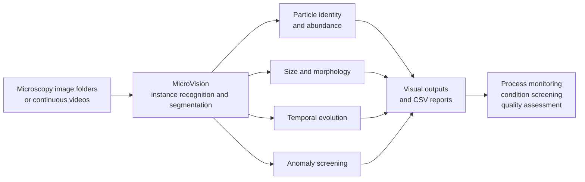

<p align="center">
  
</p>

<h1 align="center">MicroVision</h1>

<p align="center">
  <strong>Particle-resolved visual process analysis for pharmaceutical formulation development</strong>
</p>

<p align="center">
  Microscopy images in. Particle identities, instance masks, morphology, temporal trends, anomaly signals, and downloadable reports out.
</p>

<p align="center">
  <a href="https://XXX123.com"><strong>Try MicroVision Online: XXX123.com</strong></a>
</p>

## Overview

Microscopy provides a direct view of particle outlines, sizes, abundance, aggregation states, and temporal evolution in pharmaceutical systems. However, these images are still commonly interpreted through manual inspection or limited offline measurements. **MicroVision** transforms microscopy image folders and videos into structured, interpretable, particle-resolved information that can support process understanding, experimental comparison, anomaly screening, and formulation-development decisions.

MicroVision integrates model inference, instance segmentation, morphological measurement, temporal statistics, anomaly rules, visualization, and downloadable reporting in a unified workflow. It can provide:

- Particle class, confidence score, bounding box, and instance mask;
- Particle counts and morphology metrics, including area, circularity, filling ratio, eccentricity, aspect ratio, and relative size;
- Image-, frame-, and video-level class composition and temporal trends;
- Label-, morphology-, and confidence-based anomaly flags;
- Annotated images or videos, CSV tables, and complete downloadable result archives.

MicroVision is designed for research and formulation-development workflows. It does not replace confirmatory physicochemical methods such as PXRD, Raman spectroscopy, or HPLC. Instead, it provides continuous, spatially resolved, particle-level visual information that complements these measurements.

---

## From Microscopy to Particle-Resolved Evidence



The workflow is intentionally modular. Users may perform straightforward instance segmentation, enable morphology-based screening, analyze sampled video frames, or export quantitative measurements for downstream statistical analysis.

---

## MicroBench: The Data Foundation of MicroVision

MicroVision is built upon **MicroBench**, an instance-level particle formulation dataset containing:

- **4,300** online in situ and offline microscopy images;
- **148,401** annotated particle instances;
- Three representative particle systems: crystals, droplets, and microspheres;
- Two imaging domains: online in situ and offline microscopy;
- Seven target classes: Agg, Block, Plate, Rod, Bubble, Droplet, and Microsphere.

MicroBench preserves the visual complexity of real experiments, including class imbalance, within-class morphological heterogeneity, density variation, particle overlap, class co-occurrence, and imaging-domain shifts. These properties make it suitable for evaluating models under conditions that more closely resemble practical particle formulation analysis.

<p align="center">
  
  
</p>

The complete MicroBench training dataset will be released free of charge after publication of the associated research article.

---

## Systematic Model Benchmarking

Seven representative instance-segmentation implementations were evaluated using consistent data splits, class definitions, annotations, and evaluation protocols:

- Baseline Mask R-CNN;
- YOLO26;
- YOLACT;
- GSAM1;
- GSAM2;
- Mask R-CNN–R50–FPN implemented with MMDetection;
- Mask R-CNN–R50–FPN implemented with Detectron2.

The comparison considered overall segmentation accuracy, online and offline imaging domains, class-specific performance, strict-IoU mask quality, training-data scale, and deployment cost. The unified Detectron2 model achieved an overall mask mAP@0.5:0.95 of **0.766 ± 0.005** and was selected as the visual core of MicroVision.

<p align="center">
  
  
</p>

---

## Validated Applications

MicroVision has been evaluated in multiple pharmaceutical experiments that were independent of the model-development data.

### Methionine Crystal Growth Monitoring

Continuous microscopy videos were converted into class-specific particle-count trajectories, allowing rapid identification of early crystal appearance, growth, population stabilization, and later aggregation.

### Carbamazepine Morphology Evolution

MicroVision tracked continuous changes in crystal morphology composition and helped identify time windows associated with changes in the solid-state process. These visual signals can guide targeted PXRD or Raman sampling without claiming that morphology alone directly identifies a polymorph.

### Ibuprofen Crystallization-Condition Screening

Multiple experimental conditions were compared using effective crystal coverage, crystal abundance, particle size, dispersion, size uniformity, repeatability, and target morphology composition. The resulting visual metrics supported rapid prioritization of candidate crystallization conditions.

### External Droplet Quantification

On microscopy images from an independent source, MicroVision reproduced trends in droplet abundance and mean relative area across low- to high-density scenes, demonstrating transferability beyond the model-development data.

### Visual Estimation of Microsphere Drug Loading

Instance segmentation was combined with locally background-corrected optical-density measurements to establish a calibration relationship between the visual appearance of risperidone microspheres and HPLC-measured drug loading. The workflow demonstrates how particle-resolved imaging can complement conventional sample-level chemical measurements.

Together, these applications extend MicroVision from automated particle annotation to process monitoring, sampling-window identification, experimental-condition screening, and rapid visual estimation of formulation quality attributes.

---

## Online Platform

MicroVision has been deployed as a web platform and can be accessed at:

### [https://XXX123.com](https://XXX123.com)

The online interface allows users to:

1. Upload an image directory or a video;
2. Configure confidence and video-sampling parameters;
3. Select a Crystal, Droplet, or Microsphere target system;
4. Optionally enable morphology- and confidence-based anomaly rules;
5. Submit a prediction job and monitor its progress;
6. Inspect class composition, count trends, relative area, and anomaly summaries;
7. Download annotated media, CSV files, or a complete ZIP archive.

The public server may impose limits on upload size, daily job count, and the number of sampled video frames. Do not upload personal, clinical, confidential, or otherwise sensitive information.

---

## Repository Structure

```text
detectron2_MicroVision/
├── detectron2/                              # Detectron2 source code
├── configs/                                 # Model configurations
├── finetune_weights/                        # MicroVision model weights
├── detectron2_predict_monitoring_unified.py # Unified command-line pipeline
├── detectron2_batch_predict_monitoring_anomaly.py
├── MicroVision_Usage_Instructions.md        # Detailed CLI guide
├── README.md
└── microvision_web/
    ├── app.py                               # FastAPI backend
    ├── static/                              # Front-end HTML, CSS, and JavaScript
    ├── figure_for_about/                    # Full-resolution scientific figures
    ├── figure_logo_bg/                      # Logo and visual assets
    ├── jobs/                                # Runtime uploads and outputs
    └── README.md
```

---

## Local Installation

### System Requirements

- Linux is recommended;
- Python 3.9;
- An NVIDIA GPU with a compatible CUDA environment is recommended;
- PyTorch, TorchVision, CUDA, and the compiled Detectron2 extensions must be mutually compatible;
- FFmpeg is required for H.264 video export;
- Sufficient disk space is required for model weights, uploaded files, and prediction outputs.

The currently validated environment includes:

| Component   | Validated version |
| ----------- | ----------------: |
| Python      |            3.9.23 |
| PyTorch     |       2.1.2+cu121 |
| TorchVision |      0.16.2+cu121 |
| NumPy       |            1.26.4 |
| OpenCV      |            4.11.0 |
| Pandas      |             2.0.3 |
| FastAPI     |           0.125.0 |
| Uvicorn     |            0.39.0 |

Other compatible versions may also work. The CUDA-enabled PyTorch build and locally compiled Detectron2 extension must match the host system.

### 1. Create a Conda Environment

```bash
conda create -n microvision python=3.9 -y
conda activate microvision
```

### 2. Install PyTorch

The following command is an example for CUDA 12.1. Select the appropriate PyTorch build for your server and CUDA driver.

```bash
python -m pip install torch==2.1.2 torchvision==0.16.2 --index-url https://download.pytorch.org/whl/cu121
```

### 3. Install MicroVision/Detectron2 and Runtime Dependencies

Run the following commands from the repository root:

```bash
cd /path/to/detectron2_MicroVision
python -m pip install --upgrade pip setuptools wheel
python -m pip install "numpy<2" pandas opencv-python matplotlib tqdm
python -m pip install -e .
python -m pip install fastapi "uvicorn[standard]" python-multipart
```

On a headless server, `opencv-python-headless` may be used instead of `opencv-python`. Do not install both packages in the same environment.

### 4. Install FFmpeg

For Ubuntu or Debian:

```bash
sudo apt-get update
sudo apt-get install -y ffmpeg
```

### 5. Prepare the Model and Shared Utility Module

The default web configuration expects the following files:

```text
detectron2_MicroVision/
├── detectron2_predict_monitoring_unified.py
├── detectron2_batch_predict_monitoring_anomaly.py
├── configs/
├── detectron2/
├── finetune_weights/
│   └── model_final_copypaste.pth
└── microvision_web/
    └── app.py
```

If the released model uses a different filename, update `DEFAULT_WEIGHTS` in `microvision_web/app.py` or place the weight file at the configured location. The availability of model weights in the repository may depend on the specific release package.

### 6. Validate the Environment

```bash
python -c "import torch, cv2, pandas, fastapi, uvicorn; import detectron2; print('PyTorch:', torch.__version__); print('CUDA available:', torch.cuda.is_available()); print('Detectron2:', detectron2.__version__)"
ffmpeg -version
```

---

## Starting the Web Application

Run the application from the repository root:

```bash
cd /path/to/detectron2_MicroVision
export MICROVISION_DEVICE=cuda:0
python -m uvicorn microvision_web.app:app --host 0.0.0.0 --port 8008
```

Open the following address in a browser:

```text
http://127.0.0.1:8008
```

For development, automatic reloading can be enabled:

```bash
python -m uvicorn microvision_web.app:app --host 0.0.0.0 --port 8008 --reload
```

Do not use `--reload` for a production GPU inference service. The current application uses an in-process task queue and a preloaded model. A production deployment should therefore use a single Uvicorn worker, with systemd, Supervisor, or a container platform managing the process externally.

---

## Data, Models, and Reproducibility

- The complete MicroBench training dataset will be released free of charge after publication of the associated article;
- Model weights, data splits, training configurations, and supplementary resources will be documented with the official release;
- Record the code version, model weights, CUDA/PyTorch environment, confidence threshold, and anomaly rules when reproducing an analysis;
- New microscopes, illumination settings, magnifications, and sample-preparation procedures may introduce domain shifts. Manual review of a representative subset is recommended before large-scale analysis in a new imaging setting.

---

## Non-Commercial Use Notice

MicroVision is free for personal, educational, academic, and non-profit research use. **Commercial use is prohibited without prior written permission from the authors.**

Permitted non-commercial uses include:

- Academic research and methodological evaluation;
- Teaching demonstrations and coursework;
- Internal research conducted by non-profit institutions;
- Reproduction and comparison of published research results.

The following activities require prior written permission:

- Integration into a paid product, commercial software package, or commercial website;
- Provision of fee-based analytical services using MicroVision;
- Redistribution of the code, models, interface, or visual assets for commercial gain;
- Removal or misleading modification of authorship, source, or license notices.

For commercial licensing, collaborative development, large-scale analysis, or customized deployment, please contact the project authors or the corresponding author of the associated publication. Formal contact information will be added to the official release.

This project-level notice applies to MicroVision-specific code, models, and visual assets. Detectron2 and other third-party components remain subject to their respective licenses. A standalone `LICENSE` file should be included in the official release to provide complete legal terms.

MicroVision is a research and development tool. It is not intended for clinical diagnosis, batch-release testing, or regulatory decision-making without appropriate independent validation.

---

## Citation

The associated article is currently in preparation. After publication, please cite the article and the MicroBench dataset record. The recommended citation and DOI will be updated here.

---

## Contact

For bug reports, feature requests, academic collaboration, commercial licensing, dataset questions, or customized deployment, please contact the project authors or the corresponding author of the associated publication. Author names, affiliations, and email addresses will be added to the official release.

---
